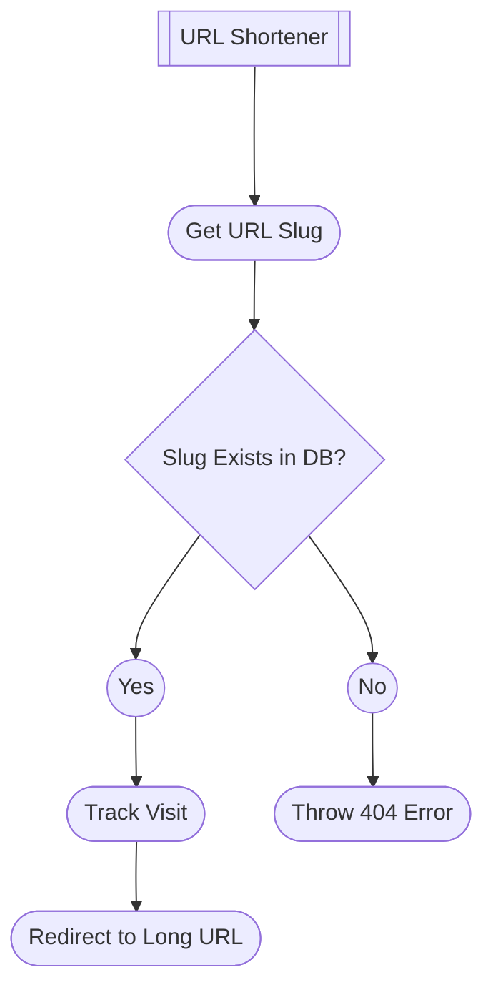
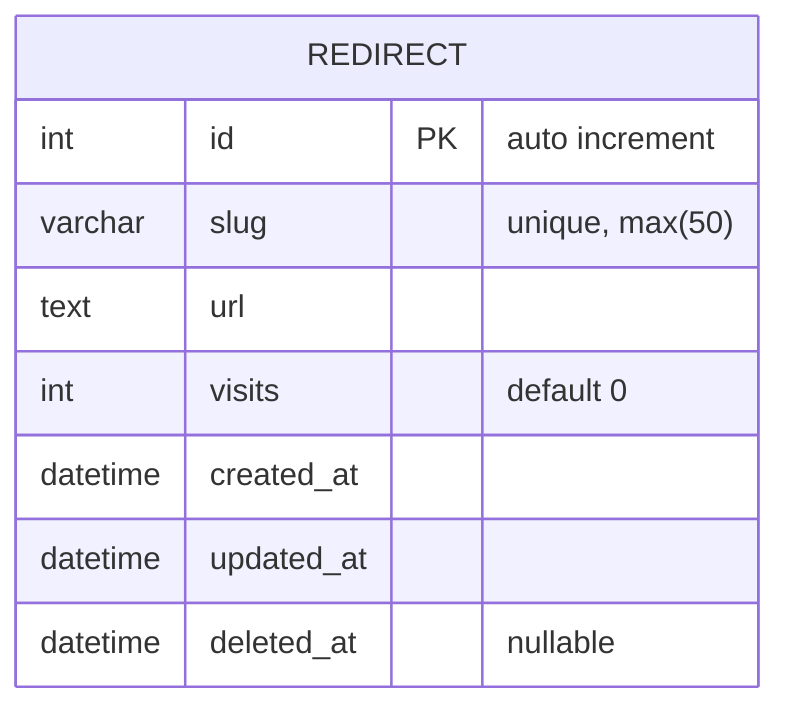

---
# These are optional elements. Feel free to remove any of them.
status: accepted
date: 2022-08-18
deciders: Kristin Collins
---
# URL Shortener Feature

## Context and Problem Statement

We need the ability to shorten Fathom Analytic campaign URLs for social media.

## Decision Drivers

* URLs that contain UTM tracking are very long.
* Social media has character limits for posts.
* We might want to update the links we provide advertisers without having to request the change directly from them.

## Flowchart

## ERD

