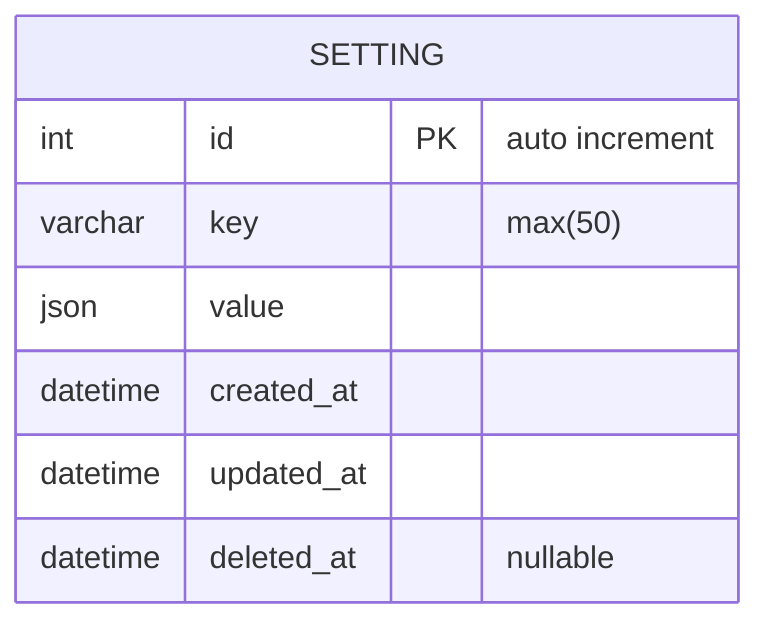

---
# These are optional elements. Feel free to remove any of them.
status: accepted
date: 2022-08-23
deciders: Kristin Collins
---
# Storage for list of tracking options.

## Context and Problem Statement

UTM links require parameters that should be consistent. In order to solve this,
a list of options should be stored within the application to populate a select
input.

## Decision Drivers

* A list for each query string parameter will need basic CRUD operations.
* Parameters should follow a particular standard.
* Parameters should be unique.

## Considered Options

* Storing parameter lists in config.
* Storing parameter lists in separate databases.
* Storing parameter lists in the same database as urls.
* Storing parameter lists in a settings database.

## Decision Outcome

Chosen option: Storing parameter lists in a settings database, because
it will be easier to maintain changes to the list while also keeping storage
to a minimum.

## ERD

