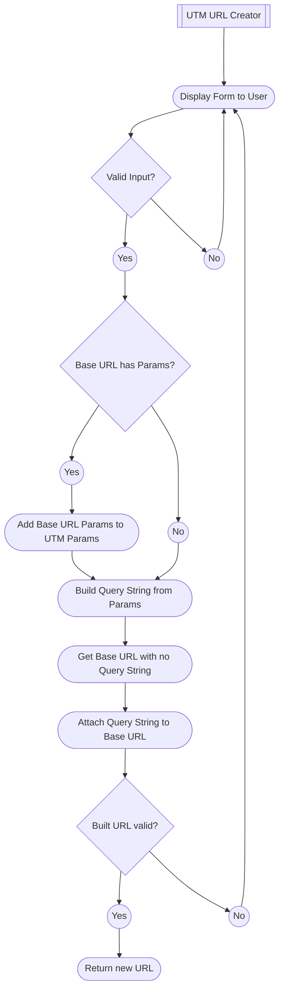
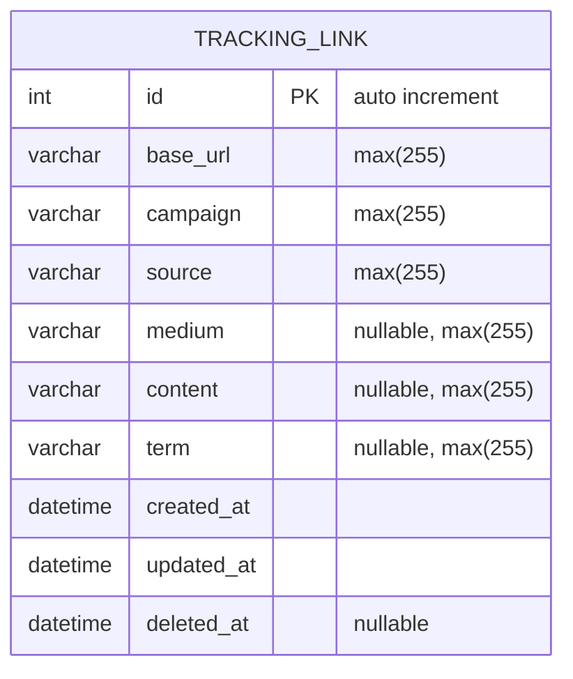

---
# These are optional elements. Feel free to remove any of them.
status: accepted
date: 2022-08-24
deciders: Kristin Collins
---
# UTM URL Creator

## Context and Problem Statement

URM urls need to be created using the UTM settings.

## Decision Drivers

* URL parameters need to follow the same format.
* UTM URLs need to be stored for reference.

## Decision Outcome

The URL creator will include a dropdown list for each UTM parameter defined
as a setting.

## Flowchart

## ERD

